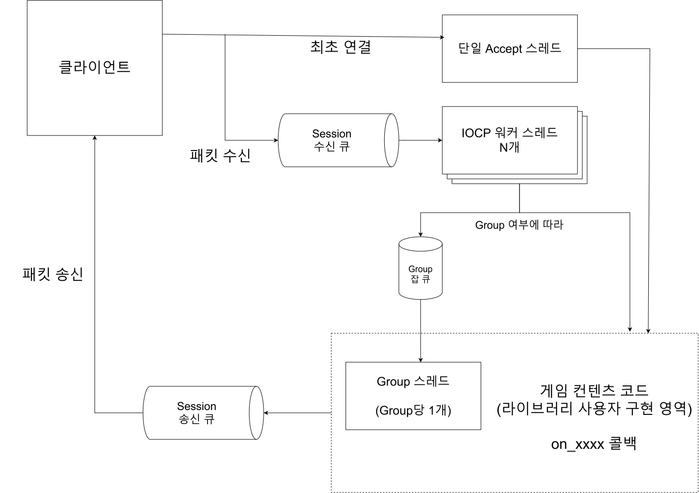
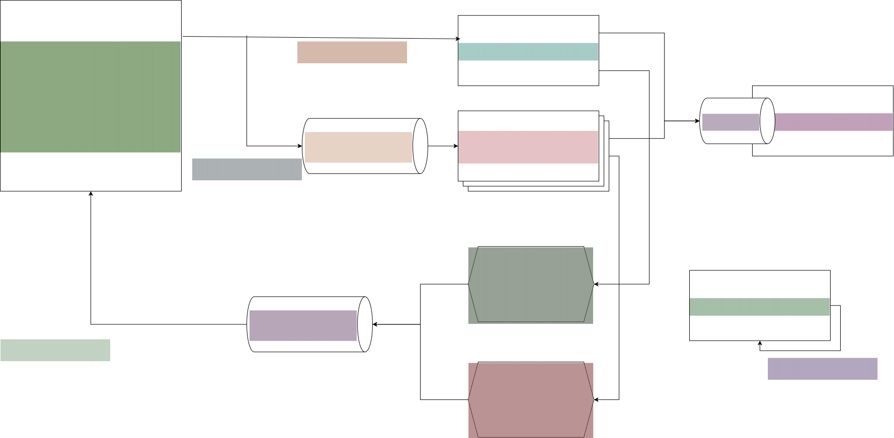
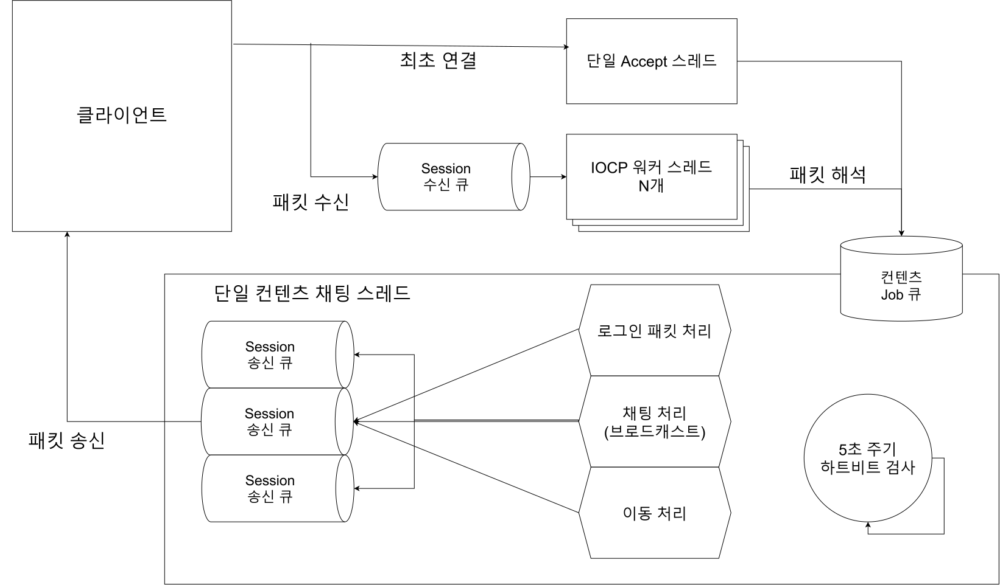
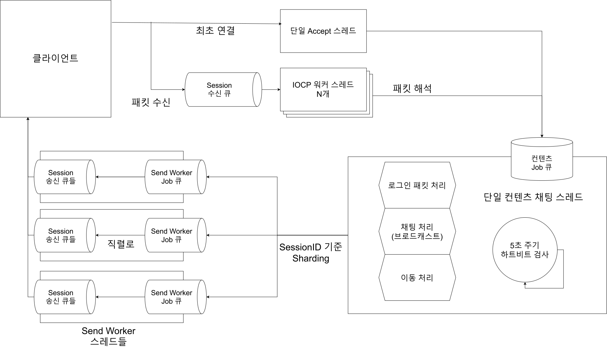

# ajylib

**Windows IOCP 기반 C++20 게임 서버 라이브러리**


[](LICENSE.md)

## Highlight

> ### 초기 설계 기준 에코 패킷 송/수신 각각 30~40만 TPS -> 7일간 평균 165만 TPS
>
> 싱글 게임 스레드를 가정한 Echo 부하 테스트에서 처음 대비 약 **4.5배** 성능 개선

> ### 수 시간마다 로그인 토큰 실패 -> 7일 무중단 테스트 로그인 실패 0개
>
> 로그인 서버와 채팅 서버의 분산 구조에서의 동시성과 순서 문제 추적의 기록

> ### 수 분마다 유령 세션/서버 프리징 발생 -> 7일 무중단 테스트 실행에서 유령 세션 0개

<details>
<summary>세션 수명에서 lock-free queue까지, 원인 추적을 위한 디버깅 과정의 기록</summary>

초기의 IOCP 코어는 송신과 수신 양쪽에 `RingBuffer`를 사용하였고, 세션을 하나의 map에 저장하고 전역 lock을 잡는 형태였습니다.
이는 단순하지만, 성능과 구조적으로는 아쉬움이 많은 방법이었습니다.

먼저 수신에서는 TCP에서 부분 전송으로 인해 패킷의 경계가 깔끔하게 오지 않으므로, 패킷을 저장해둘 공간이 필요했습니다.
그러나 송신에까지 `RingBuffer`를 사용하게 된다면, 이미 직렬화가 끝나서 버퍼에 복사가 끝난 패킷을
다시 링버퍼로 옮겨야 하므로 `memcpy`가 생기게 됩니다. 만약 같은 패킷을 여러번 보내야 한다면 그만큼 복사 횟수가 늘어납니다.

이미 만들어진 패킷은 내부에 버퍼를 가지고 있고 데이터를 담고 있으므로 그 주소만을 전달하면 됩니다.
따라서 패킷의 포인터를 lock-free 큐에 넣고 `WSABUF` 배열이 그 버퍼들을 가리키게 합니다.
그리고 이 세션의 `send_flag`를 잡은 스레드에서 lock-free 큐의 내용을 몰아서 보냅니다.

이 방법을 통해서 `memcpy`를 줄일 뿐만 아니라, 같은 세션의 send에 대해서 batching이 가능해졌습니다. (최대 128개를 묶습니다)


다음은 세션의 lock 비중을 줄인 과정입니다.

초기에는 세션을 `std::unordered_map`에 저장하고, 세션 맵에 lock을 걸어서 사용하였습니다.
unordered_map은 알고리즘적으로 O(1)의 조회 성능을 가지고 있고, key-value를 사용하므로 자연스러운 선택이었습니다.
서버에서 세션에 행하는 가장 흔한 연산은 삽입이나 삭제가 아닌 조회니까요.

그러나, 조회 O(1) 뒤에는 숨은 상수가 있습니다. 조회 한 번이 해시 계산, 버킷 탐색과 역참조로 나뉘고
배열이나 vector와 같은 연속된 자료구조와 다르게 캐시 지역성이 떨어집니다.

그리고 더 큰 비용은 맵을 사용하면서 생기는 lock에 있었습니다.
맵은 삽입과 삭제가 자유롭지만 서버에서 새 세션이 들어오고 나갈 때마다 map이 변할 수 있습니다.
이는 data race이므로 이를 최소한 shraed_mutex으로 맵을 보호해야 했습니다.

그러면 세션이 들어오거나 나갈 때마다 모든 조회도 멈추게 되어 병렬성이 감소하게 됩니다.

따라서, 최대 세션 수가 이미 정해진 서버인 만큼 고정 크기의 배열에 세션을 담고
세션 ID에 배열 index에다가 자신의 세대 번호를 합친 고유 값을 만들어서, 세션의 변화가 있으면 구분되게 바꾸었습니다.
배열 인덱스 연산 또한 O(1)이고 캐시 지역성도 높으며, 무엇보다 더 이상 전역 shared_mutex가 필요 없어지게 되었습니다.


하지만 위 2가지를 개선하고 나니 예상 외의 문제가 발생했습니다.
에코 서버의 TPS가 0으로 감소하여 회복되지 않거나, 서버의 종료 단계가 영원히 끝나지 않는 문제가 발생했습니다.

TPS가 0으로 감소하지만 세션이 끊기진 않았습니다.
더미 클라이언트는 에코 응답을 받아야 다음 에코 패킷을 보내는데, 서버가 패킷을 보내지 않는 상태가 지속되는겁니다.

작성했던 비동기 로거를 사용해서, 워커 스레드 함수의 종료 단계에서 종료 흐름에 대한 정보를 남기도록 수정하니
몇몇 스레드들이 GQCS 루프 중에서 멈춰서 GQCS 함수로 돌아오지 못하고 있는 것을 발견했습니다.

로거를 활용하여 범위를 좁혀가던 중 RingBuffer를 제거하기 위해서 넣은 lock-free 큐에 문제가 있음을 알아냈습니다.

락프리 큐를 분석한 AI는 반복해서 16-bit 태그 포인터의 오버플로우로 인한 CAS 통과, 이로 인한 ABA 문제를 의심했습니다.
그러나, 제가 Windows와 스레드에 대해서 알고 있는 지식으로 판단하면 이는 거의 불가능한 주장이었습니다.
단순히 오버플로우가 일어나면 발생하는게 아니라 정확히 65536의 배수로 돌아오는 그 순간에, 포인터 주소까지 일치해야 합니다.
거기에 65536번 다른 스레드에서 성공적인 삽입/삭제가 일어나는 동안 스레드가 돌지 못하는 상황이어야 발생합니다.

확인을 위해서 서버의 구조와 비슷하게 생산자, 소비자가 나오는 구성으로 자료구조의 스트레스 테스트를 준비했습니다.
그래서 비교 대조를 위해서 lock-free 스택과 큐를 같은 테스트를 돌렸습니다.
결과는 stack은 매 번 무사히 통과하는데 비해서 queue는 돌린지 수 초도 되지 않아서 생산자, 소비자 둘 다 진행이 멈췄습니다.

이 테스트로 알 수 있는 점은, ABA 문제의 방지를 위해서 넣은 태그드 포인터의 문제가 아니라는 것
그리고 큐의 로직 자체에 결함이 있다는 것이었습니다.

제 큐는 Michael-Scott의 큐를 기반으로 하고 있었기에 하나씩 논문의 로직과 1:1로 대조해가며 검수했고
결국 Dequeue 로직에 결함이 있었음을 확인했습니다.
`head->next`가 비어 있지 않으면 `head == tail`인지, 즉 뒤처진 tail을 미는 과정이 생략되어 있던 것이 문제였습니다.
이 경우 head가 tail을 지나갈 수 있고, tail이 이미 반납된 노드를 가리키며, 그게 재사용되는 순간 큐가 망가집니다.

논문과 달랐던 부분을 수정하니 테스트도 통과하였고, 서버 문제도 해결되었습니다.

</details>

## Overview

ajylib는 학습을 목적으로 Windows IOCP를 사용하여 직접 개발한 게임 서버 코어 라이브러리입니다.

외부 프레임워크에 의존하지 않고 네트워크 계층, lock-free 자료구조, 메모리 풀,
직렬 처리 모델 등을 직접 구현했습니다.

또한, 게임 서버의 다양한 부하 상황들을 모방한 부하 테스트 등을 실시하여, 다양한 멀티스레드 동시성 문제나 성능 문제들을 겪어보고 발전시키는 것을 목표로 하였습니다.

## Architecture



위 그림은 기본적인 서버 코어 라이브러리의 패킷 송수신 흐름입니다.

각 예제 설명을 여시면 각 예제별 추가 구현 부분을 포함하여 더 자세히 확인하실 수 있습니다.

## Modules

라이브러리는 `ajy` 네임스페이스 아래 6개 카테고리로 구성됩니다.

<details>
<summary>container</summary>

| 모듈 | 설명 |
|---|---|
| `RingBuffer` | 세션별 수신 버퍼로 사용하는 원형 버퍼 |
| `SerializationBuffer` | 직렬화 버퍼. 스트림 연산자로 타입별 읽기·쓰기 지원 |
| `lockfree::Stack` | 태그드 포인터 CAS 기반 Treiber 스택 |
| `lockfree::Queue` | 태그드 포인터 CAS 기반 Michael-Scott 큐 |
| `mpsc::Queue` | 다중 생산자·단일 소비자 Bounded Queue |

</details>

<details>
<summary>memory</summary>

| 모듈 | 설명 |
|---|---|
| `lockfree::MemoryPool` | 객체 크기 단위로 고정 크기 블록을 할당하는 lock-free 메모리 풀 |
| `lockfree::ObjectPool` | 객체 단위의 재사용을 위한 lock-free 오브젝트 풀 |
| `threadlocal::MemoryPool` | TLS를 사용하는 메모리 풀 |
| `threadlocal::ObjectPool` | TLS를 사용하는 오브젝트 풀 |

</details>

<details>
<summary>network</summary>

| 모듈 | 설명 |
|---|---|
| `Server` | 서버 인터페이스. 가상 함수로 콘텐츠 계층과 분리 |
| `windows::iocp::Server` | IOCP 기반 서버 구현 |
| `windows::iocp::NetServer` | 헤더·체크섬·난독화를 적용한 프로토콜을 사용하는 서버 |
| `protocol::PacketBuffer` | `Server`에서 사용하는 패킷 직렬화 버퍼 |
| `protocol::NetPacketBuffer` | `NetServer`에서 사용하는 난독화가 포함된 패킷 버퍼 |
| `protocol::Obfuscator` | 패킷 본문의 난독화/복호화 |

</details>

<details>
<summary>concurrency</summary>

| 모듈 | 설명 |
|---|---|
| `Group` | 세션 집합의 로직을 Actor 모델과 유사하게 전용 스레드에서 직렬 처리하는 단위 |

</details>

<details>
<summary>utility</summary>

| 모듈 | 설명 |
|---|---|
| `Logger` | 전용 스레드에서 비동기적으로 동작하는 로거 |
| `Console` | 서버 제어용 콘솔 명령 처리기 |
| `Monitor` | 프로세스·시스템 리소스 지표 수집기 |

</details>

<details>
<summary>io</summary>

| 모듈 | 설명 |
|---|---|
| `OutputDevice` | 출력 장치 추상 인터페이스 |
| `stdio::OutputDevice` | 표준 출력 구현 |
| `windows::OutputDevice` | Windows 콘솔 API 구현 |

</details>

## Examples

이 라이브러리를 사용하는 서버 예제 6종에 대한 설명입니다.

모든 서버 예제의 실험은 일반 PC가 아니라, 서버용 PC와 별도의 네트워크로 연결된 부하 테스트용 PC 2개를 사용하여 테스트하였습니다.

<details>
<summary>테스트 하드웨어 구성</summary>

**서버**

| | |
|---|---|
| CPU | Intel Xeon E5-2680 v4 · 14C/28T · 2.4GHz |
| 메모리 | 16GB DDR4-2400 |
| NIC | Intel I210 GbE ×2 |
| OS | Windows Server 2019 |

**부하 생성기**

| | 부하기 1 | 부하기 2 |
|---|---|---|
| CPU | Intel Core i5-4460 · 4C/4T · 3.2GHz | Intel Core i5-4690 · 4C/4T · 3.5GHz |
| 메모리 | 8GB DDR3-1600 | 4GB DDR3-1600 |
| NIC | Realtek GbE | Realtek GbE |
| OS | Windows Server 2019 | Windows Server 2019 |

서버의 I210 두 포트가 각각 하나의 부하 생성기와 별도 서브넷으로 연결됩니다.

</details>

<details>
<summary>echo_server - IOCP 코어 기능을 검증하기 위한 단순 에코 서버</summary>



**요약**

라이브러리를 사용하여 최초로 작성한 예제로, `iocp::Server`를 상속하여 만들었습니다.

클라이언트가 최초로 접속하면 매직 헤더가 포함된 Welcome 패킷을 보냅니다.
이후 클라이언트에게 패킷을 수신하면, 패킷을 그대로 복사하여 다시 되돌려줍니다.

이 서버에서 나온 230만 TPS라는 수치가 라이브러리에서 측정한 최대치입니다.

**최종 결과**

| 재접속 | 최대 중첩 요청 | 클라이언트 수 | 통과 여부 | Accept TPS | Recv TPS | Send TPS |
|---|---|---|---|---|---|---|
| 없음 | 1개 | 50 | 6시간 | - | 9.3만 | 9.3만 |
| 포함 | 1개 | 50 | 6시간 | 1.0만 | 1.6만 | 2.6만 |
| 없음 | 200개 | 200 (100×2) | 6시간 | - | 230만 | 230만 |
| 포함 | 200개 | 200 (100×2) | 2일 | 6천 | 180만 | 180만 |
| 포함 | 200개 | 150 (50×3, 1대는 루프백) | 2일 | 1.2만 | 220만 | 220만 |

통과 조건은 아래 다섯 가지가 한 번도 발생하지 않은 상태입니다.

(중첩 요청이란 에코 응답을 기다리지 않고 더미가 한 번에 미리 보내는 에코 수입니다.)

- 500ms 안에 에코 응답이 오지 않음
- 더미 클라이언트의 Connect 실패 (서버가 Accept를 하지 않거나 지연됨)
- 서버가 일방적으로 연결을 끊음
- 환영 패킷이 한 세션에서 중복으로 도착
- 환영 패킷이 3000ms 안에 오지 않음
- 보낸 에코와 받은 에코가 다름 (에코는 순차 증가하는 숫자이므로 순서 틀어짐도 감지됨)

**목적**

에코 서버는 받은 패킷을 그대로 돌려주면 되는 매우 간단한 로직의 서버입니다.
라이브러리의 IOCP 코어가 제대로 만들어졌는지 기능과 성능을 테스트하는 용도로 만들었습니다.

IOCP 코어의 로직이 변경될 때마다, 먼저 이 예제를 사용하여 테스트해보았습니다.
그리고 lock-free 큐의 버그나 세션 종료 순서 문제 등 몇몇 코어 로직의 문제를 이 예제를 통해서 찾아내고 디버깅하였습니다.

**실험 전제**

더미 클라이언트는 여러 스레드들이 각자 세션들을 생성하여 서버에 접속합니다.

각 세션은 0부터 1씩 단조 증가하는 정수를 숫자를 패킷에 담아서 보냅니다.
만약 보낸 echo 패킷에 대한 응답을 수신하였다면, 다음 스레드 루프에서 다음 에코를 보냅니다.

이때, 중첩 요청 수만큼 아직 에코 응답을 수신하지 않았더라도 미리 에코를 보낼 수 있습니다.
예를 들어, 100의 중첩 요청이라면 0부터 99까지의 에코를 미리 보냅니다.

재접속의 경우 일정 시간마다 일부 세션을 끊고 다시 서버에 접속시킵니다.

패킷 프로토콜은 `PacketBuffer`를 사용합니다.

스레드 루프 대기시간은 0ms, 즉 스케줄링이 허락하는 한 쉬지 않고 돌도록 설정하였습니다.

**결과 해석**

첫 두 실험은 중첩 요청이 없는 상황입니다.
더미의 세션 하나가 에코 응답을 받아야 다음 에코를 보내므로, 처리량은 RTT에 의해 결정됩니다.

실험 3은 중첩 요청을 200개까지 늘리고, 2개의 더미 생성용 pc에서 테스트를 진행했습니다.
중첩 요청으로 인해 RTT에 의한 영향은 줄어들고, TPS가 230만까지 상승합니다.

실험 4에서는 총 200개의 클라이언트가 재접속을 시도하는데 Accept TPS가 6천 가까이 나옵니다.

그러나 실험 5번에서는 150개의 클라이언트에, 서버와 동일한 PC에서 더미가 돌고 있음에도 Accept TPS가 1.2만까지 나타납니다.
이는 각 부하 생성기가 100개의 클라이언트 + 200개의 중첩 요청을 함으로써 부하 생성기 자체에 병목이 생기고 있음을 보여줍니다.

실제로 150개의 클라이언트로도 220만의 송/수신 TPS를 내는 것으로 확인할 수 있습니다.

---

</details>

<details>
<summary>chat_server - 그리드 맵 형태의 브로드캐스트 환경을 재현한 서버</summary>

채팅 서버는 비교를 위해 싱글 스레드 버전, 멀티 스레드 확장 버전 2가지가 존재합니다.



단일 채팅 스레드에서 모든 것을 처리하는 버전의 채팅 서버 아키텍쳐입니다.

3×3 범위의 모든 인접 세션으로의 브로드캐스트를 하나의 단일 채팅 스레드가 담당합니다.

단일 스레드가 모든 것을 처리하므로 전체 채팅 순서가 완전히 직렬로 처리될 수 있지만, 세션 송신 큐에 넣고 WSASend() 시스템 콜을 하는 부분이 주요 병목으로 작용합니다. 




채팅 패킷의 송신을 다수의 송신 워커 스레드가 처리하는 방식의 아키텍쳐입니다.

단일 채팅 스레드는 브로드캐스트시에 보낼 대상의 Session들을 확인한 뒤, 각각 고유한 SessionID에 따라 정해진 Worker의 Job 큐로 패킷을 전달합니다.

같은 SessionID는 항상 같은 워커가 처리하여 동일 세션 내의 패킷 순서가 섞이지 않고, 시스템 콜을 컨텐츠 스레드가 처리하지 않아서 컨텐츠 스레드에 여유가 생깁니다.

</details>

## Building

<details>
<summary>요구사항</summary>

- Windows x64
- CMake 4.2 이상
- C++20을 지원하는 컴파일러 (MSVC 기준으로 개발)

GoogleTest와 hiredis는 CMake가 빌드 시점에 내려받습니다. MySQL 연동 예제는 MySQL
C API가 별도로 설치되어 있어야 합니다.

</details>

<details>
<summary>빌드</summary>

```
cmake -S . -B build
cmake --build build --config Release
```

빌드 구성은 `Debug`, `NoOptRelease`, `Release` 세 가지입니다. `NoOptRelease`는
최적화를 끄되 릴리스 런타임을 사용하는 구성입니다.

</details>

<details>
<summary>클린 빌드</summary>

```
cmake -E rm -rf build
cmake -S . -B build
cmake --build build --config Release
```

</details>

<details>
<summary>테스트</summary>

GoogleTest 기반 단위 테스트가 포함되어 있습니다.

```
ctest --test-dir build -C Release --output-on-failure
```

</details>

<details>
<summary>옵션</summary>

| 옵션 | 기본값 | 설명 |
|---|---|---|
| `AJYLIB_BUILD_TESTS` | 최상위 프로젝트일 때 ON | 단위 테스트 빌드 |
| `AJYLIB_BUILD_EXAMPLES` | 최상위 프로젝트일 때 ON | 예제 서버 빌드 |

라이브러리만 필요한 경우 두 옵션을 끕니다.

```
cmake -S . -B build -DAJYLIB_BUILD_TESTS=OFF -DAJYLIB_BUILD_EXAMPLES=OFF
cmake --build build --config Release
```

</details>

## License

MIT License. 자세한 내용은 [LICENSE.md](LICENSE.md)를 참조하십시오.