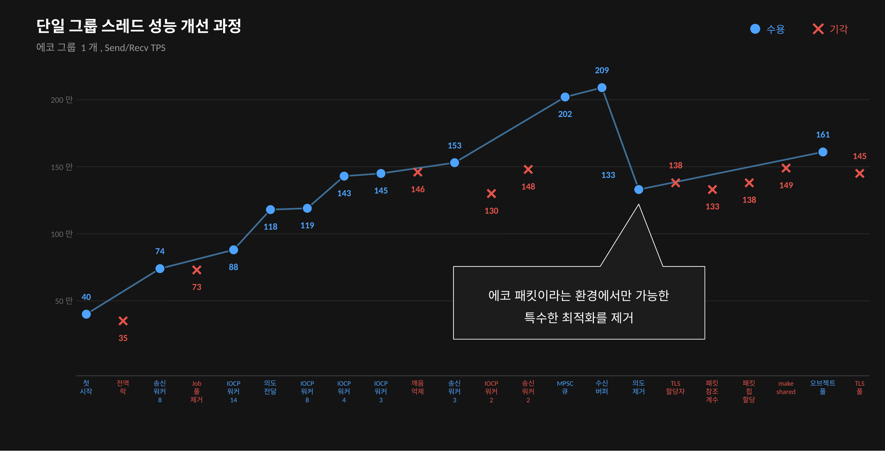
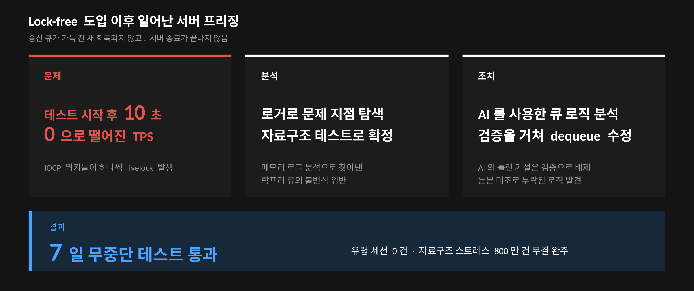
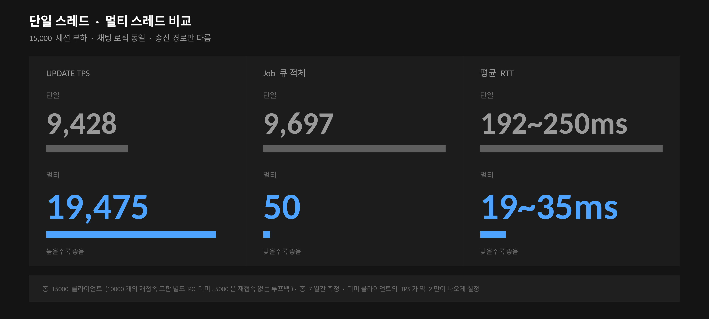
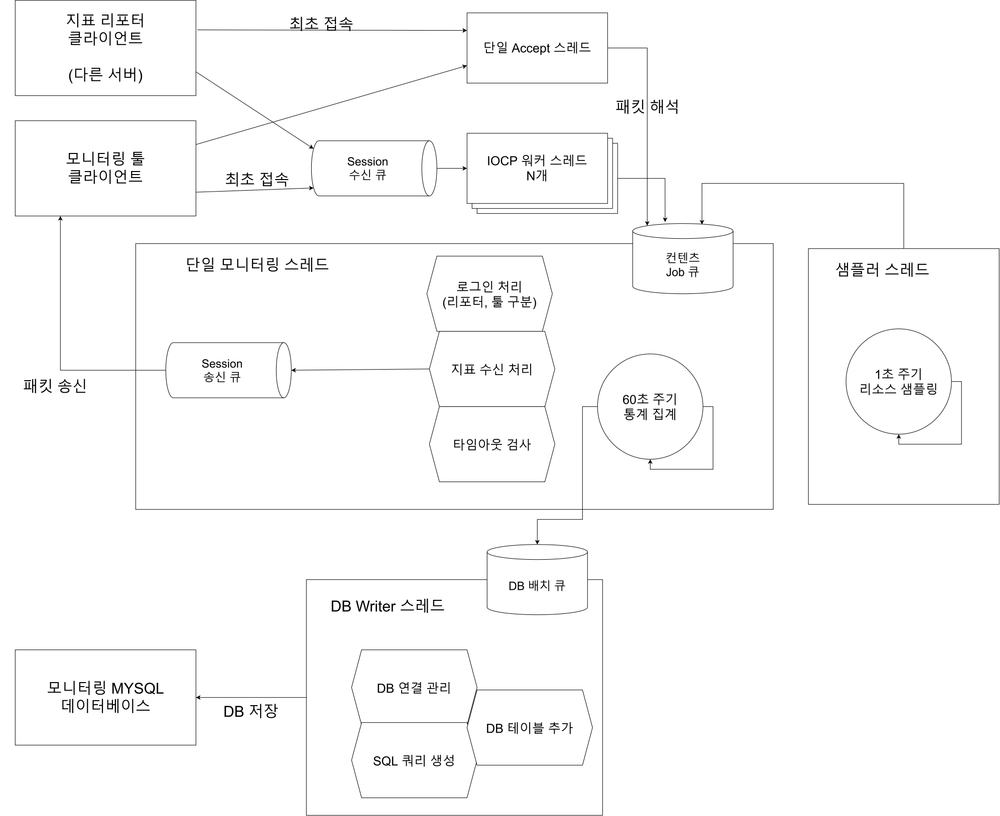
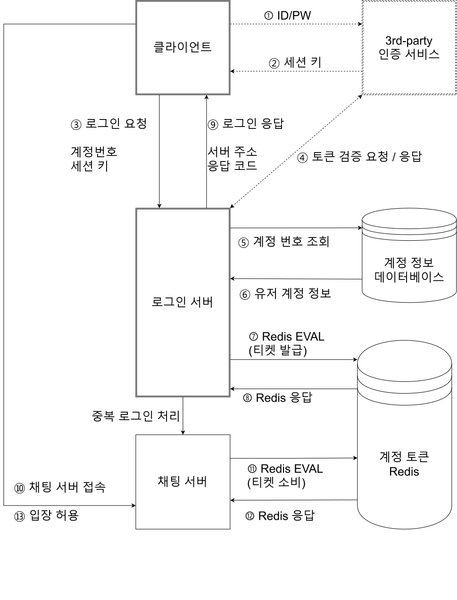
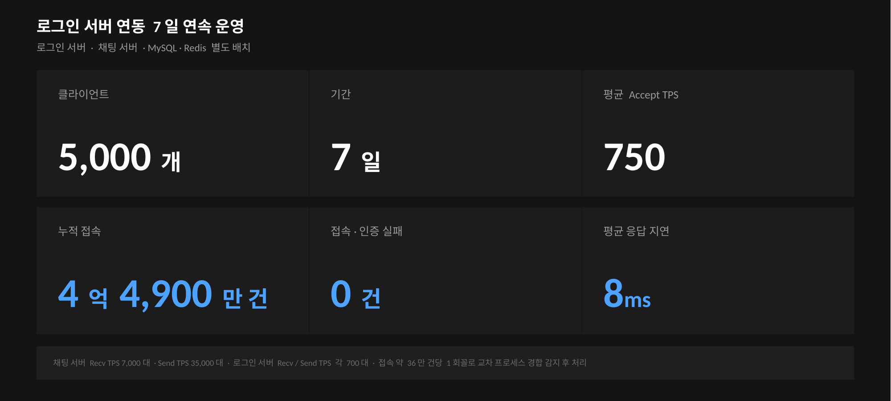
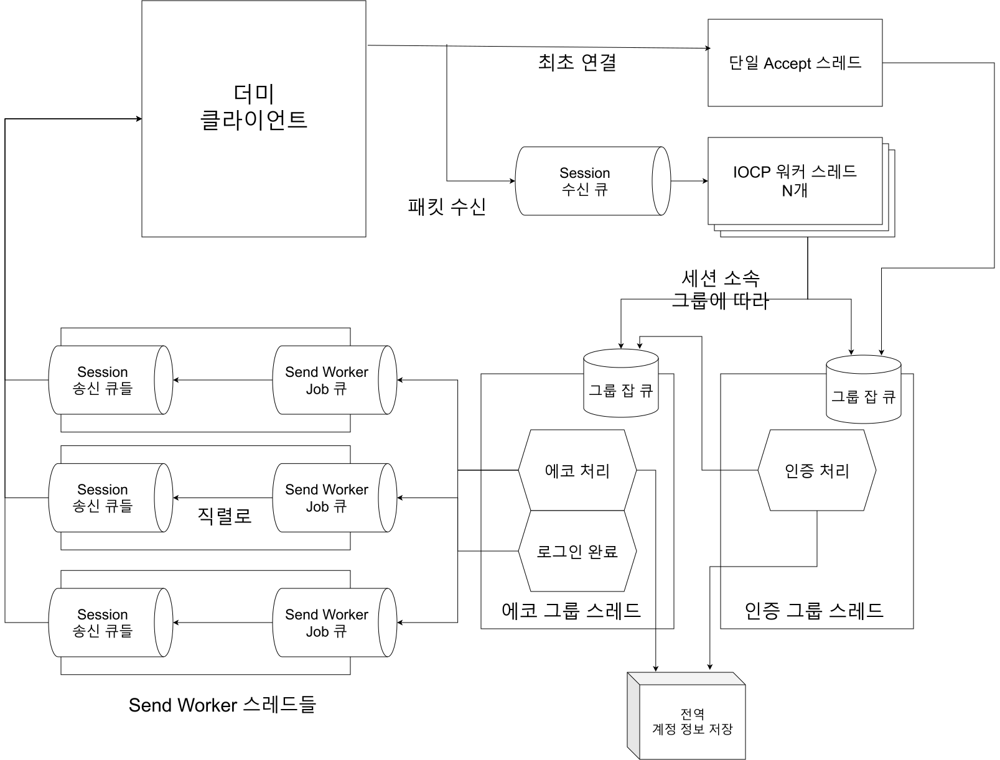
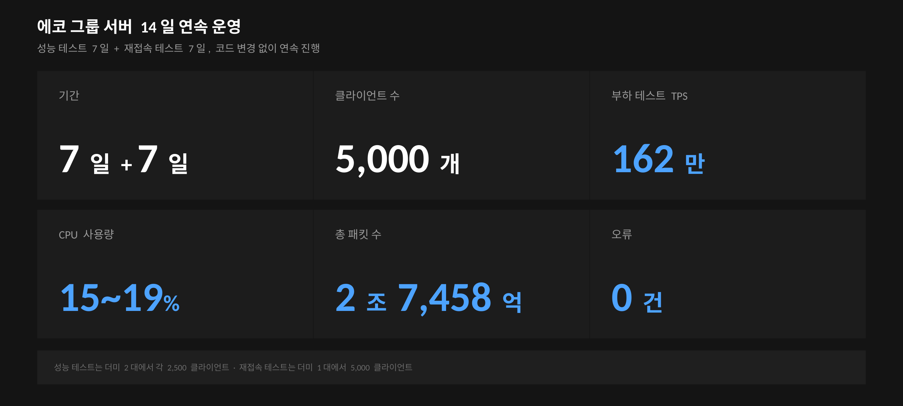

# ajylib

**Windows IOCP 기반 C++20 게임 서버 라이브러리**


[](LICENSE.md)

## Highlight






## Overview

ajylib는 학습을 목적으로 Windows IOCP를 사용하여 직접 개발한 게임 서버 코어 라이브러리입니다.

외부 프레임워크에 의존하지 않고 네트워크 계층, lock-free 자료구조, 메모리 풀,
직렬 처리 모델 등을 직접 구현했습니다.

또한, 게임 서버의 다양한 부하 상황들을 모방한 부하 테스트 등을 실시하여, 다양한 멀티스레드 동시성 문제나 성능 문제들을 겪어보고 발전시키는 것을 목표로 하였습니다.

## Architecture


위 그림은 기본적인 서버 코어 라이브러리의 패킷 송수신 흐름입니다.

각 예제 설명을 여시면 각 예제별 추가 구현 부분을 포함하여 더 자세히 확인하실 수 있습니다.

## Modules

라이브러리는 `ajy` 네임스페이스 아래 6개 카테고리로 구성됩니다.

<details>
<summary>container</summary>

| 모듈 | 설명 |
|---|---|
| `RingBuffer` | 세션별 수신 버퍼로 사용하는 원형 버퍼 |
| `SerializationBuffer` | 직렬화 버퍼. 스트림 연산자로 타입별 읽기·쓰기 지원 |
| `lockfree::Stack` | 태그드 포인터 CAS 기반 Treiber 스택 |
| `lockfree::Queue` | 태그드 포인터 CAS 기반 Michael-Scott 큐 |
| `mpsc::Queue` | 다중 생산자·단일 소비자 Bounded Queue |

</details>

<details>
<summary>memory</summary>

| 모듈 | 설명 |
|---|---|
| `lockfree::MemoryPool` | 객체 크기 단위로 고정 크기 블록을 할당하는 lock-free 메모리 풀 |
| `lockfree::ObjectPool` | 객체 단위의 재사용을 위한 lock-free 오브젝트 풀 |
| `threadlocal::MemoryPool` | TLS를 사용하는 메모리 풀 |
| `threadlocal::ObjectPool` | TLS를 사용하는 오브젝트 풀 |

</details>

<details>
<summary>network</summary>

| 모듈 | 설명 |
|---|---|
| `Server` | 서버 인터페이스. 가상 함수로 콘텐츠 계층과 분리 |
| `windows::iocp::Server` | IOCP 기반 서버 구현 |
| `windows::iocp::NetServer` | 헤더·체크섬·난독화를 적용한 프로토콜을 사용하는 서버 |
| `protocol::PacketBuffer` | `Server`에서 사용하는 패킷 직렬화 버퍼 |
| `protocol::NetPacketBuffer` | `NetServer`에서 사용하는 난독화가 포함된 패킷 버퍼 |
| `protocol::Obfuscator` | 패킷 본문의 난독화/복호화 |

</details>

<details>
<summary>concurrency</summary>

| 모듈 | 설명 |
|---|---|
| `Group` | 세션 집합의 로직을 Actor 모델과 유사하게 전용 스레드에서 직렬 처리하는 단위 |

</details>

<details>
<summary>utility</summary>

| 모듈 | 설명 |
|---|---|
| `Logger` | 전용 스레드에서 비동기적으로 동작하는 로거 |
| `Console` | 서버 제어용 콘솔 명령 처리기 |
| `Monitor` | 프로세스·시스템 리소스 지표 수집기 |

</details>

<details>
<summary>io</summary>

| 모듈 | 설명 |
|---|---|
| `OutputDevice` | 출력 장치 추상 인터페이스 |
| `stdio::OutputDevice` | 표준 출력 구현 |
| `windows::OutputDevice` | Windows 콘솔 API 구현 |

</details>

## Examples

이 라이브러리를 사용하는 서버 예제 6종에 대한 설명입니다.

모든 서버 예제의 실험은 일반 PC가 아니라, 서버용 PC와 별도의 네트워크로 연결된 부하 테스트용 PC 2개를 사용하여 테스트하였습니다.

<details>
<summary>테스트 하드웨어 구성</summary>

---

**서버**

| | |
|---|---|
| CPU | Intel Xeon E5-2680 v4 · 14C/28T · 2.4GHz |
| 메모리 | 16GB DDR4-2400 |
| NIC | Intel I210 GbE ×2 |
| OS | Windows Server 2019 |

---

**부하 생성기**

| | 부하기 1 | 부하기 2 |
|---|---|---|
| CPU | Intel Core i5-4460 · 4C/4T · 3.2GHz | Intel Core i5-4690 · 4C/4T · 3.5GHz |
| 메모리 | 8GB DDR3-1600 | 4GB DDR3-1600 |
| NIC | Realtek GbE | Realtek GbE |
| OS | Windows Server 2019 | Windows Server 2019 |

서버의 I210 두 포트가 각각 하나의 부하 생성기와 별도 서브넷으로 연결됩니다.

---

</details>

<details>
<summary>echo_server - IOCP 코어 기능을 검증하기 위한 단순 에코 서버</summary>

### echo_server - IOCP 코어 기능을 검증하기 위한 단순 에코 서버

---

**요약**

라이브러리를 사용하여 최초로 작성한 예제로, `windows::iocp::Server`를 상속하여 만들었습니다.

클라이언트가 최초로 접속하면 매직 헤더가 포함된 Welcome 패킷을 보냅니다.
이후 클라이언트에게 패킷을 수신하면, 패킷을 그대로 복사하여 다시 되돌려줍니다.

이 서버에서 나온 230만 TPS라는 수치가 라이브러리에서 실측한 최대치입니다.


---

**최종 결과**

| 재접속 | 최대 중첩 요청 | 클라이언트 수 | 통과 여부 | Accept TPS | Recv TPS | Send TPS |
|---|---|---|---|---|---|---|
| 없음 | 1개 | 50 | 6시간 | - | 9.3만 | 9.3만 |
| 포함 | 1개 | 50 | 6시간 | 1.0만 | 1.6만 | 2.6만 |
| 없음 | 200개 | 200 (100×2) | 6시간 | - | 230만 | 230만 |
| 포함 | 200개 | 200 (100×2) | 2일 | 6천 | 180만 | 180만 |
| 포함 | 200개 | 150 (50×3, 1대는 루프백) | 2일 | 1.2만 | 220만 | 220만 |

통과 조건은 아래 여섯 가지가 한 번도 발생하지 않은 상태입니다.

(중첩 요청이란 에코 응답을 기다리지 않고 더미가 한 번에 미리 보내는 에코 수입니다.)

- 500ms 안에 에코 응답이 오지 않음
- 더미 클라이언트의 Connect 실패 (서버가 Accept를 하지 않거나 지연됨)
- 서버가 일방적으로 연결을 끊음
- 환영 패킷이 한 세션에서 중복으로 도착
- 환영 패킷이 3000ms 안에 오지 않음
- 보낸 에코와 받은 에코가 다름 (에코는 순차 증가하는 숫자이므로 순서 틀어짐도 감지됨)

---

**목적**

에코 서버는 받은 패킷을 그대로 돌려주면 되는 매우 간단한 로직의 서버입니다.
라이브러리의 IOCP 코어가 제대로 만들어졌는지 기능과 성능을 테스트하는 용도로 만들었습니다.

IOCP 코어의 로직이 변경될 때마다, 먼저 이 예제를 사용하여 테스트해보았습니다.
그리고 lock-free 큐의 버그나 세션 종료 순서 문제 등 몇몇 코어 로직의 문제를 이 예제를 통해서 찾아내고 디버깅하였습니다.

---

**실험 전제**

더미 클라이언트는 여러 스레드가 각자 세션을 생성하여 서버에 접속합니다.

각 세션은 0부터 1씩 단조 증가하는 정수를 패킷에 담아서 보냅니다.
만약 보낸 echo 패킷에 대한 응답을 수신하였다면, 다음 스레드 루프에서 다음 에코를 보냅니다.

이때, 중첩 요청 수만큼 아직 에코 응답을 수신하지 않았더라도 미리 에코를 보낼 수 있습니다.
예를 들어, 100의 중첩 요청이라면 0부터 99까지의 에코를 미리 보냅니다.

재접속의 경우 일정 시간마다 일부 세션을 끊고 다시 서버에 접속시킵니다.

패킷 프로토콜은 `PacketBuffer`를 사용합니다.

스레드 루프 대기시간은 0ms, 즉 스케줄링이 허락하는 한 쉬지 않고 돌도록 설정하였습니다.

---

**결과 해석**

첫 두 실험은 중첩 요청이 없는 상황입니다.
더미의 세션 하나가 에코 응답을 받아야 다음 에코를 보내므로, 처리량은 RTT에 의해 결정됩니다.

실험 3은 중첩 요청을 200개까지 늘리고, 2개의 더미 생성용 pc에서 테스트를 진행했습니다.
중첩 요청으로 인해 RTT에 의한 영향은 줄어들고, TPS가 230만까지 상승합니다.

실험 4에서는 총 200개의 클라이언트가 재접속을 시도하는데 Accept TPS가 6천 가까이 나옵니다.

그러나 실험 5번에서는 150개의 클라이언트에, 서버와 동일한 PC에서 더미가 돌고 있음에도 Accept TPS가 1.2만까지 나타납니다.
이는 각 부하 생성기가 100개의 클라이언트 + 200개의 중첩 요청을 함으로써 부하 생성기 자체에 병목이 생기고 있음을 보여줍니다.

실제로 150개의 클라이언트로도 220만의 송/수신 TPS를 내는 것으로 확인할 수 있습니다.

---

</details>

<details>
<summary>chat_server - 그리드 맵 형태의 브로드캐스트 환경을 재현한 서버</summary>

### chat_server - 그리드 맵 형태의 브로드캐스트 환경을 재현한 서버

---

**요약**

`windows::iocp::NetServer`를 상속하여 만든 최초의 예제입니다.

고전 RPG에서 캐릭터 머리 위에 말풍선이 뜨는 방식의 채팅을 재현했습니다.
50×50 섹터 격자 형태의 맵 안에 수많은 클라이언트가 존재하며, 클라이언트가 채팅을 보내면, 서버는 그 채팅을 자신을 포함한 3×3 섹터에 브로드캐스트합니다.

섹터 이동은 단순성을 위해 서버가 아니라 클라이언트 권위를 선택했습니다. 섹터 이동 자체는 별도의 게임 서버에서 이루어진다 가정하고 클라이언트가 자신의 위치를 채팅 서버에 전달합니다.

패킷은 로그인, 섹터 이동, 채팅, 하트비트 4종류가 존재합니다.

채팅 서버는 비교를 위해 싱글 스레드 버전, 멀티 스레드 확장 버전 2가지가 존재합니다.


단일 채팅 스레드에서 모든 것을 처리하는 버전의 채팅 서버 아키텍처입니다.

3×3 범위의 모든 인접 세션으로의 브로드캐스트를 하나의 단일 채팅 스레드가 담당합니다.

단일 스레드가 모든 것을 처리하므로 전체 채팅 순서가 완전히 직렬로 처리될 수 있지만, 세션 송신 큐에 넣고 WSASend() 시스템 콜을 하는 부분이 주요 병목으로 작용합니다. 


채팅 패킷의 송신을 다수의 송신 워커 스레드가 처리하는 방식의 아키텍처입니다.

단일 채팅 스레드는 브로드캐스트시에 보낼 대상의 Session들을 확인한 뒤, 각각 고유한 SessionID에 따라 정해진 Worker의 Job 큐로 패킷을 전달합니다.

같은 SessionID는 항상 같은 워커가 처리하여 동일 세션 내의 패킷 순서가 섞이지 않고, 시스템 콜을 채팅 스레드가 처리하지 않아서 채팅 스레드에 여유가 생깁니다.

---

**최종 결과**



같은 더미 조건에서 두 서버를 비교한 결과입니다.  
싱글 구성에서 채팅 스레드의 처리 속도가 Job 큐에 쌓이는 속도를 따라가지 못하여 발생하던 지연을 해소하였습니다.

---

**목적**

`echo_server`는 수신과 송신이 1:1인 구조라 브로드캐스트를 다루지 않습니다.
라이브러리가 실제 게임 상황의 부하를 감당할 수 있는지 확인하려면 1:N의 상황이 필요했습니다.

이 예제는 맵을 격자로 나누고 자신이 속한 섹터와 인접한 8개 섹터에만 전달하는 Area of Interest 기반 브로드캐스트를 사용합니다.

브로드캐스트가 패킷 송신의 다수인 상황에서 병목이 어디에 생기고 어떻게 줄일 수 있는지 확인하기 위한 서버입니다.

그리고 프로토콜 불일치와 체크섬 실패 등의 핸들링 또한 포함되어 있습니다.

---

**실험 전제**

더미 클라이언트는 접속 후 로그인하고, 주기적으로 섹터를 이동하며 채팅을 보냅니다.
서버 전체의 Update TPS가 약 2만이 되도록 더미 송신 빈도를 설정했습니다.

더미용 PC 2대에서는 각각 5000개의 클라이언트씩 총 10000 클라이언트가 접속하며, 낮은 확률의 재접속을 포함하여 더미 루프를 실행합니다.
서버와 같은 PC에서는 5000개의 클라이언트가 루프백으로 접속하여 재접속 없이 루프를 실행합니다.

하트비트는 구현되어 있으나, 7일 테스트에는 사용하지 않았습니다. 더미가 확률적 행동을 사용해서 7일이라는 시간에는 정상 세션이 끊길 수 있어서입니다.

잘못된 프로토콜이나 체크섬이 맞지 않는 패킷 등을 대량으로 보내는 검사 또한 진행했습니다.

---

**결과 해석**

단일 채팅 스레드가 모든 것을 다 하는 구성에서는 Update TPS가 약 9천대에 머물렀고 Job 큐가 9천 건 적체되어 있었습니다.

이는 채팅 스레드의 처리 속도가 Job이 쌓이는 속도를 따라가지 못함을 의미합니다. 그 결과로 RTT가 200ms 이상이 나와서 클라이언트의 응답성이 나쁨을 확인할 수 있었습니다.

송신 부분을 멀티스레드화 한 구성에서는 같은 상황에서 Job 큐에 들어가는 즉시 처리할 수 있을 정도로 병목이 해소되어 RTT가 40ms 이하로 내려갔습니다.

두 구성의 차이는 송신 경로 하나뿐이었습니다.  
따라서, 병목의 원인은 매 패킷 전송마다 반복되는 `WSASend` 시스템 콜 호출이었음이 드러납니다.

프로토콜 위반 패킷의 경우는 라이브러리가 전부 미리 걸러내어 해당 세션만 정리하는 것에 성공하였습니다.  
다른 세션이나 플레이어 맵 상태 등에는 어떠한 영향도 없었습니다.

---

</details>

<details>
<summary>monitor_server - 다른 서버의 리소스 사용량을 집계하고 DB와 연동하여 저장하는 서버</summary>

### monitor_server - 다른 서버의 리소스 사용량을 집계하고 DB와 연동하여 저장하는 서버

---

**요약**

다른 서버에서 CPU, 메모리 사용량, 네트워크 사용량, 운영 정보 등의 통계를 받고 이를 인증된 모니터링 툴에 전송하는 서버입니다.

또한, 60초 간격마다 집계한 데이터를 자동으로 연결된 MySQL DB에 저장합니다.



모니터링 서버에 연결하는 클라이언트는 샘플을 전달하는 다른 서버, 그리고 모니터링 툴로 2종류입니다.

지표를 보내는 쪽은 서버 번호만 전달하고 바로 샘플을 전달하게 되고 모니터링 서버는 아무것도 보내지 않습니다.  
툴의 경우는 로그인 키 검증을 통과하면 모니터링 서버가 툴로 통계 정보를 전송합니다.

이 모니터링 서버 자신이 도는 PC의 CPU, 메모리, 네트워크 지표도 1초마다 측정하여 모니터링 스레드에서 같은 형태로 처리합니다.

---

**목적**

앞선 예제들을 테스트할 때 서버는 수 일씩 돌아가는데 문제는 언제 발생할지 알 수 없습니다.

그래서 모니터링 툴과 연동되는 서버를 만들어서, 실시간으로 여러 서버들의 상태를 한 눈에 확인할 수 있게 하고
각 서버가 보내는 상태를 시간 정보와 함께 모아두고 나중에 통계로 확인할 수 있게 했습니다.

`chat_server`의 Update TPS와 Job 큐 적체, `echo_server`의 Recv/Send TPS 등을 이 서버를 통해 수집했습니다.

---

</details>

<details>
<summary>login_gated_chat - Redis를 통해 두 서버가 인증 토큰을 주고받는 구조</summary>

### login_gated_chat - Redis를 통해 두 서버가 인증 토큰을 주고받는 구조

---

**요약**

로그인 서버와 채팅 서버를 별도의 프로세스로 분리하고, 그 사이에서 Redis를 사용하는 토큰 인증 과정을 추가한 구성입니다.

로그인 서버가 MySQL로 계정을 확인하고 Redis에 짧은 수명의 인증 티켓을 발급합니다. 클라이언트는 그 티켓을 들고 채팅 서버에 접속하고, 채팅 서버는 티켓을 소비하면서 그 자리에 세션 상태를 기록합니다.

채팅 서버는 chat_server 예제에 토큰 인증 관문이 붙은 것입니다.



점선 부분은 이번 프로젝트에서는 생략된 부분입니다. DB 조회 부분은 Select Query를 사용하여 조회 부하만 재현하였습니다.

---

**최종 결과**



Redis 키 하나가 티켓과 접속 상태를 겸했던 시기의 측정 기록입니다.

현재 저장소 상태는 이후 티켓과 세션 상태를 별도 키로 분리하고 티켓에 TTL 10초를 붙인 형태로 개선된 버전입니다. 실측 결과는 유사합니다.

---

**목적**

여러 서버가 분산되어 있는 환경을 가정하고, 로그인 절차를 구현해 보는 데 목적을 둔 프로젝트입니다.

Redis를 사용하여 서버 간 티켓과 접속 상태를 공유하며, 여러 서버가 Redis를 사용할 때 일어나는 분산 환경에서의 동시성 문제를 경험하고 이를 다뤄 보는 데 중점을 두었습니다.

---

**실험 전제**

더미 클라이언트는 5000개이며, 각각 고유한 계정 번호를 가집니다.  
로그인 서버에 접속해 로그인하고, 받은 IP와 포트로 채팅 서버에 접속하고, 확률적으로 채팅을 치다가 퇴장하고 재접속합니다.

로그인 서버, 채팅 서버, MySQL, Redis는 동일한 서버 컴퓨터에서 실행되었습니다.
로그인 서버와 채팅 서버는 별도의 프로세스로, 서로 다른 포트 번호를 사용합니다.

유효한 로그인 응답을 받은 뒤의 채팅 서버 로그인 실패가 발생하면 테스트 실패로 판정합니다.

---

**개발 과정**

초기 개발 과정 중 재접속 과정에서 채팅 서버의 세션 정리 작업이 새로 발급된 티켓을 지우는 경합이 접속 약 36만 건당 1회꼴로 발생했습니다.
로그인 서버와 채팅 서버가 서로 다른 프로세스이므로 한쪽에서만 순서를 맞출 수 없고, 두 서버가 공유하는 Redis에서 원자적으로 처리해야 했습니다.

Redis의 EVAL 기능을 사용하여 티켓 삭제를 값 비교 후 삭제하는 단일 연산으로 바꾸어 해당 발생을 차단하였고
이후 7일간 4억 4,900만 건의 접속 동안 실패가 없었습니다.

추가적으로 중복 로그인의 더 안전한 처리를 위해서 접속 상태와 세션 티켓을 분리하는 리팩토링을 진행하였으며
이후 세션 티켓은 짧은 TTL을 가지는 현재의 형태로 발전했습니다.

---

</details>

<details>
<summary>echo_with_group - 직렬 처리 게임 로직 스레드를 가정한 서버에서의 성능 부하 테스트</summary>

### echo_with_group - 직렬 처리 게임 로직 스레드를 가정한 서버에서의 성능 부하 테스트

---

**요약**

서버의 모든 컨텐츠 로직 처리를 하나의 스레드에서 직렬로 처리하는 상황을 가정한 에코 서버입니다.  
세션이 각자 소속된 그룹을 가지고, 같은 그룹에서의 로직 처리는 모두 직렬로 처리됩니다.



서버에 접속하면 인증 그룹에서 로그인을 처리하고 에코 그룹으로 옮겨갑니다.  
각 그룹에서는 모든 패킷을 그룹 큐에 들어온 순서대로 처리합니다  
(로그인 완료 패킷은 에코 그룹 스레드의 도착 시점에 보냅니다)

---

**최종 결과**



의도 전달이 빠진 `echo_with_group`의 측정 결과입니다.  
Echo FPS가 평균 10 이상 나오는 정도로 더미 부하를 조정한 상태에서 측정하였습니다.

---

**목적**

기존의 `echo_server`는 에코 처리를 수신한 IOCP 워커가 병렬적으로 처리했습니다.
그러나, 실제 게임의 로직은 순서가 중요하고 공유되는 자원이 많아 병렬성이 제한됩니다.

이 서버는 모든 에코 수신을 그룹의 작업 큐에 놓고 단일 스레드가 이를 직렬 처리하도록 하였습니다.
실제 게임 로직이 전체 상태를 소유하고 직렬로 처리하는 구조를 가정한 것입니다.

이때 서버에 높은 부하를 주어서 성능을 측정해가며 병목이 발생하는 위치를 찾아내고 개선해가는 과정을 체험하기 위한 예제입니다.

---

**실험 전제**

더미 클라이언트는 접속 후 로그인하고, 에코 요청을 반복해서 보냅니다. 로그인 응답을 받기 전까지는 에코를 보내지 않습니다.
`echo_server`와 유사하게 에코 중첩 요청이 가능합니다.

성능 테스트는 더미 2대에서 각 2,500 클라이언트, 총 5,000으로 7일간 운영했습니다. 재접속 테스트는 더미 1대에서 5,000 클라이언트가 반복 접속·해제하며 7일간 운영했습니다.  
두 개의 테스트는 같은 실행 파일로 연속하여 실시하였습니다.

많은 TPS로 인하여 네트워크 장비의 부하가 걸리는 현상이 있어서 TCP의 Nagle 옵션을 켠 상태로 측정을 진행하였습니다.
짧은 Loop와 낮은 중첩 요청으로 TPS를 높이면 Nagle 옵션으로도 네트워크 부하가 커져서, 200ms의 더미 루프를 사용하고 대신 중첩 요청 수를 늘려서 TPS를 높였습니다.

---

**의도 전달에 대해**

에코 서버에서만 가능하다고 판단하여 제거한 특수한 최적화 방법입니다.
이를 제거하였을 때 200만 이상의 TPS가 133만으로 감소하였으며, 이후에 다른 성능 개선으로 다시 162만까지 TPS를 상승시켰습니다.

`echo_with_group_intent` 버전은 에코 그룹 스레드가 패킷을 완성하고 송신 워커에 전달하는 대신, 패킷 완성을 송신 워커의 책임으로 미룬 형태입니다.  
대신, 패킷을 완성할 수 있는 에코 문자열 등의 정보를 복사하여 전달합니다.

이 형태는 직렬화 구간을 더 좁혀서 성능을 크게 높일 수 있지만, 대부분의 게임 패킷은 이와 같은 형태를 사용할 수 없습니다.
패킷에 담아야 하는 정보가 단순 문자열 하나가 아니라, 길이를 알 수 없는 게임 정보들이기 때문입니다.

---

</details>

## Building

<details>
<summary>요구사항</summary>

- Windows x64
- CMake 4.2 이상
- C++20을 지원하는 컴파일러 (MSVC 기준으로 개발)

GoogleTest와 hiredis는 CMake가 빌드 시점에 내려받습니다. MySQL 연동 예제는 MySQL
C API가 별도로 설치되어 있어야 합니다.

</details>

<details>
<summary>빌드</summary>

```
cmake -S . -B build
cmake --build build --config Release
```

빌드 구성은 `Debug`, `NoOptRelease`, `Release` 세 가지입니다. `NoOptRelease`는
최적화를 끄되 릴리스 런타임을 사용하는 구성입니다.

</details>

<details>
<summary>클린 빌드</summary>

```
cmake -E rm -rf build
cmake -S . -B build
cmake --build build --config Release
```

</details>

<details>
<summary>테스트</summary>

GoogleTest 기반 단위 테스트가 포함되어 있습니다.

```
ctest --test-dir build -C Release --output-on-failure
```

</details>

<details>
<summary>옵션</summary>

| 옵션 | 기본값 | 설명 |
|---|---|---|
| `AJYLIB_BUILD_TESTS` | 최상위 프로젝트일 때 ON | 단위 테스트 빌드 |
| `AJYLIB_BUILD_EXAMPLES` | 최상위 프로젝트일 때 ON | 예제 서버 빌드 |

라이브러리만 필요한 경우 두 옵션을 끕니다.

```
cmake -S . -B build -DAJYLIB_BUILD_TESTS=OFF -DAJYLIB_BUILD_EXAMPLES=OFF
cmake --build build --config Release
```

</details>

## License

MIT License. 자세한 내용은 [LICENSE.md](LICENSE.md)를 참조하십시오.