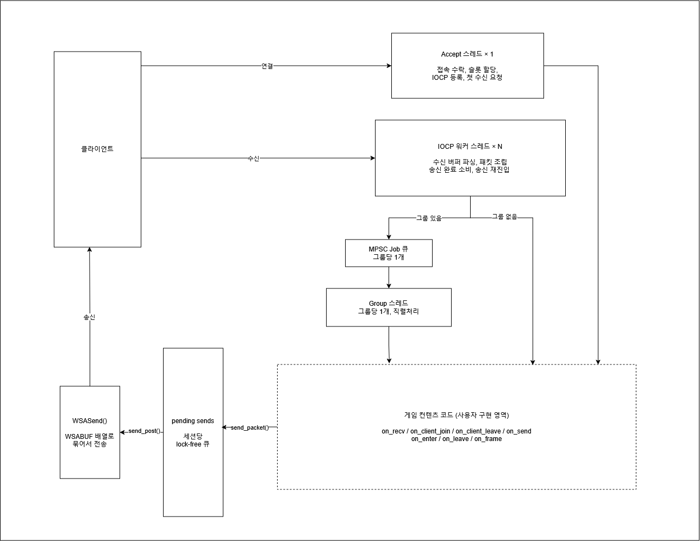

# ajylib

**Windows IOCP 기반 C++20 게임 서버 라이브러리**


[](LICENSE.md)

## Overview

ajylib는 Windows IOCP 위에 게임 서버를 구현하기 위한 C++20 라이브러리입니다.
상용 프레임워크에 의존하지 않고 네트워크 계층, lock-free 자료구조, 메모리 풀,
직렬 처리 모델을 직접 구현하여, 게임 서버가 요구하는 성능과 동시성 문제를
다루는 것을 목표로 했습니다. 구현 과정에서는 컴파일러 확장에 의존하지 않고
표준 C++ 범위 안에 머무르도록 노력했습니다.

라이브러리 API가 실제 서버 구현에 충분한지, 부하 상태에서 성능이 유지되는지,
장시간 운영에서 안정적인지를 검증하기 위해 서버 예제 6종을 함께 구현했습니다.
예제는 단순 에코 서버에서 시작해 다중 서버 인증 구성까지 확장됩니다.

## Architecture



## Modules

라이브러리는 `ajy` 네임스페이스 아래 6개 카테고리로 구성됩니다.

### container

| 모듈 | 설명 |
|---|---|
| `RingBuffer` | 세션별 수신 버퍼로 사용하는 원형 버퍼 |
| `SerializationBuffer` | 직렬화 버퍼. 스트림 연산자로 타입별 읽기·쓰기 지원 |
| `lockfree::Stack` | 태그드 포인터 CAS 기반 Treiber 스택 |
| `lockfree::Queue` | 태그드 포인터 CAS 기반 Michael-Scott 큐 |
| `mpsc::Queue` | 다중 생산자·단일 소비자 유계 큐 |

### memory

| 모듈 | 설명 |
|---|---|
| `lockfree::MemoryPool` | 고정 크기 블록 풀. 다중 스레드 할당·해제 |
| `lockfree::ObjectPool` | 객체 단위 풀. 생성자·소멸자 호출 관리 |
| `threadlocal::MemoryPool` | 스레드 지역 블록 풀. 원자적 연산 없이 동작 |
| `threadlocal::ObjectPool` | 스레드 지역 객체 풀 |

### network

| 모듈 | 설명 |
|---|---|
| `Server` | 서버 인터페이스. 가상 함수로 콘텐츠 계층과 분리 |
| `windows::iocp::Server` | IOCP 기반 서버 구현 |
| `windows::iocp::NetServer` | 헤더·체크섬·난독화를 적용한 프로토콜 서버 |
| `protocol::PacketBuffer` | 패킷 직렬화 버퍼 |
| `protocol::NetPacketBuffer` | 네트워크 헤더가 붙는 패킷 버퍼 |
| `protocol::Obfuscator` | 패킷 페이로드 난독화 |

### concurrency

| 모듈 | 설명 |
|---|---|
| `Group` | 세션 집합을 전용 스레드에서 직렬 처리하는 단위 |

### utility

| 모듈 | 설명 |
|---|---|
| `Logger` | 전용 스레드에서 동작하는 비동기 로거 |
| `Console` | 서버 제어용 콘솔 명령 처리 |
| `Monitor` | 프로세스·시스템 리소스 지표 수집 |

### io

| 모듈 | 설명 |
|---|---|
| `OutputDevice` | 출력 장치 추상 인터페이스 |
| `stdio::OutputDevice` | 표준 출력 구현 |
| `windows::OutputDevice` | Windows 콘솔 API 구현 |

## Examples

저장소에는 라이브러리를 사용하는 서버 예제 6종이 포함됩니다. 각 예제는 앞선
예제의 구조 위에 요소를 하나씩 더해가며, 라이브러리가 실제 서버 구현에 충분한지
확인하는 대상이 됩니다.

측정은 Xeon E5-2680 v4(14C/28T) · 16GB · Intel I210 GbE ×2 · Windows Server 2019
서버에서 진행했으며, 부하 생성기는 i5급 1U 서버 2대를 각각 별도 서브넷에
연결했습니다.

### echo_server

`iocp::Server`를 직접 상속한 최소 구성입니다. 2바이트 길이 헤더만 사용하며,
수신한 페이로드를 그대로 되돌려보냅니다. 콘텐츠 스레드도 그룹도 없어 IOCP 워커가
`on_recv`에서 곧바로 응답합니다. 자체 프로세스 지표를 1초 주기로 수집해 콘솔에
표시하는 지표 수집기를 함께 둡니다.

부하 생성기 2대에서 각 100 세션이 8바이트 페이로드를 응답 대기 없이 200개까지
중첩 전송하는 조건에서 239만 TPS를 기록했습니다.

### chat_server

`NetServer`를 사용하는 첫 예제로, 5바이트 헤더와 체크섬, 난독화가 적용된 프로토콜
경로를 사용합니다. 50×50 섹터 배열 위에 플레이어를 배치하고 자신을 포함한 3×3
섹터로 채팅을 브로드캐스트하며, 5초 주기 하트비트 검사로 응답 없는 세션을
정리합니다. 프로토콜 위반 시 검증 후 즉시 연결을 끊습니다.

단일 스레드와 멀티스레드 두 구성을 함께 유지합니다. 단일 스레드 구성은 콘텐츠
스레드 하나가 lock-free Job 큐를 비우며 월드 상태를 단독 소유하고, 응답과
브로드캐스트 송신까지 직접 수행합니다. 멀티스레드 구성은 월드 상태 소유는 그대로
두고 브로드캐스트 송신만 워커 풀로 넘깁니다. 콘텐츠 스레드가 패킷을 완성한 뒤
`(SessionID, packet)` 작업을 세션 ID 해시로 샤딩해 전달하므로 세션별 순서가
보존됩니다.

7일간 연속 운영했습니다. 더미 3대로 15,000 세션을 유지하되 그중 2대는 반복
재접속을 수행합니다. 동일 조건에서 단일 스레드 구성은 UPDATE TPS 9,400, Job 큐
적체 9,700을 기록했고, 멀티스레드 구성은 UPDATE TPS 19,000, Job 큐 적체 거의
없음을 기록했습니다.

### monitor_server

다른 예제들이 보내는 지표를 수집해 MySQL에 적재하는 서버입니다. 하나의
`NetServer`가 지표를 보내는 서버와 조회 도구를 함께 받으며, 로그인 패킷 종류로
역할을 구분하고 역할별로 다른 타임아웃을 적용합니다.

콘텐츠 스레드가 서버 번호와 지표 종류별로 개수·합·최소·최대를 집계하고, 60초마다
전용 DB 스레드로 넘겨 월 단위 테이블에 기록합니다. 해당 월 테이블이 없으면
템플릿에서 생성한 뒤 재시도합니다. DB 연결이 끊겨도 집계는 계속 동작합니다.
서버 프로세스가 아닌 별도 객체를 통해 호스트 자체의 지표도 같은 경로로
수집합니다.

### login_gated_chat

로그인 서버와 채팅 서버를 분리하고 그 사이를 Redis 인증 티켓으로 연결한 구성입니다.
로그인 서버는 MySQL로 계정을 인증하고 Redis에 TTL 10초의 일회용 티켓을 발급하며,
채팅 서버는 세션 점유 확인과 티켓 검증, 소비, 세션 상태 기록을 단일 원자적 연산으로
처리합니다.

로그인 서버는 하나의 프로세스에서 클라이언트용 리스너와 서버 간 통신용 리스너를
함께 운영합니다. 콘텐츠 서버가 후자에 자신의 접속 주소를 등록하면 로그인 서버는
설정 상수가 아니라 등록된 주소를 클라이언트에 알려주며, 중복 로그인을 감지하면
해당 콘텐츠 서버로 종료를 통보합니다. 채팅 서버 쪽에서는 전용 스레드가 로그인
서버에 접속을 유지하며 이 통보를 수신합니다.

5,000 클라이언트로 7일간 연속 운영했습니다. 채팅 서버는 Accept TPS 700대,
Recv TPS 7,000대, Send TPS 35,000대를 유지했으며, 누적 4억 4,900만 건의 접속 동안
접속 실패와 인증 실패로 인한 접속 종료는 발생하지 않았습니다. 평균 응답 지연은
8ms였습니다.

이 시점의 인증 모델은 Redis 키 하나가 인증 티켓과 접속 상태를 겸하는 구조였습니다.
재접속 시 이전 세션의 지연된 정리 작업이 새로 발급된 티켓을 삭제하는 교차 프로세스
경합이 관측되어 원자적 비교-삭제로 차단했으며, 이후 두 역할을 별도 키로 분리하는
현재 구조로 재설계했습니다.

### echo_with_group

`concurrency::Group`을 사용하는 구성입니다. 세션은 접속 시 인증 그룹에 들어가
로그인을 처리한 뒤 에코 그룹으로 이동하며, 각 그룹은 전용 스레드에서 소속 세션의
작업을 직렬 처리합니다. 그룹 이동 시 계정 번호는 서버가 소유한 별도 저장소를 통해
전달됩니다. 그룹 간 이동은 세션 식별자만 전달하므로, 인증이 만들어낸 상태를
넘기려면 별도의 경로가 필요하기 때문입니다.

응답 송신은 그룹 스레드가 직접 하지 않고 송신 워커 풀로 넘깁니다.

성능 테스트와 재접속 테스트를 코드 변경 없이 같은 실행 파일로 연속 진행하여 총
14일간 운영했습니다. 성능 테스트는 5,000 세션에서 양방향 각 150만 TPS 이상, 메모리
1GB 미만이 조건이었고, 7일간 양방향 각 162만 TPS를 기록했습니다. 재접속 테스트는
5,000 세션이 반복 접속·해제를 수행하는 조건에서 7일간 운영하여 Accept TPS 1,100과
양방향 각 60만 ~ 70만 TPS를 유지했습니다. 메모리는 두 테스트 모두 1GB 미만을
유지했습니다.

### echo_with_group_intent

`echo_with_group`과 한 곳만 다릅니다. 그룹 스레드가 완성된 패킷 대신 응답에 필요한
필드만 담은 32바이트 값을 송신 워커에 넘기고, 패킷 할당과 직렬화를 워커가
수행합니다. 무엇을 보낼지 정하는 것은 직렬 구간의 일이지만 그것을 바이트로 바꾸는
것은 아니라는 구분입니다.

`echo_with_group`은 약 170만 TPS에서 그룹 스레드가 작업 처리에 포화되어 프레임
루프를 돌지 못하는 반면, 이 구성은 190만 TPS까지 프레임을 유지합니다.

다만 이 방식은 일반화되지 않습니다. 실제 게임 패킷은 월드 상태의 스냅샷을 담기
때문에 전달할 값이 32바이트에 그치지 않고, 그만한 데이터를 큐에 복사해 넣고
꺼내는 비용이 직렬 구간에서 덜어낸 비용을 상쇄합니다. 에코 응답이 고정된 몇 개의
필드로 표현되기 때문에 성립하는 구성이며, 참고용으로 함께 둡니다.

## Building

### 요구사항

- Windows x64
- CMake 4.2 이상
- C++20을 지원하는 컴파일러 (MSVC 기준으로 개발)

GoogleTest와 hiredis는 CMake가 빌드 시점에 내려받습니다. MySQL 연동 예제는 MySQL
C API가 별도로 설치되어 있어야 합니다.

### 빌드

```
cmake -S . -B build
cmake --build build --config Release
```

빌드 구성은 `Debug`, `NoOptRelease`, `Release` 세 가지입니다. `NoOptRelease`는
최적화를 끄되 릴리스 런타임을 사용하는 구성입니다.

### 클린 빌드

```
cmake -E rm -rf build
cmake -S . -B build
cmake --build build --config Release
```

### 테스트

GoogleTest 기반 단위 테스트가 포함되어 있습니다.

```
ctest --test-dir build -C Release --output-on-failure
```

### 옵션

| 옵션 | 기본값 | 설명 |
|---|---|---|
| `AJYLIB_BUILD_TESTS` | 최상위 프로젝트일 때 ON | 단위 테스트 빌드 |
| `AJYLIB_BUILD_EXAMPLES` | 최상위 프로젝트일 때 ON | 예제 서버 빌드 |

라이브러리만 필요한 경우 두 옵션을 끕니다.

```
cmake -S . -B build -DAJYLIB_BUILD_TESTS=OFF -DAJYLIB_BUILD_EXAMPLES=OFF
cmake --build build --config Release
```

## License

MIT License. 자세한 내용은 [LICENSE.md](LICENSE.md)를 참조하십시오.
